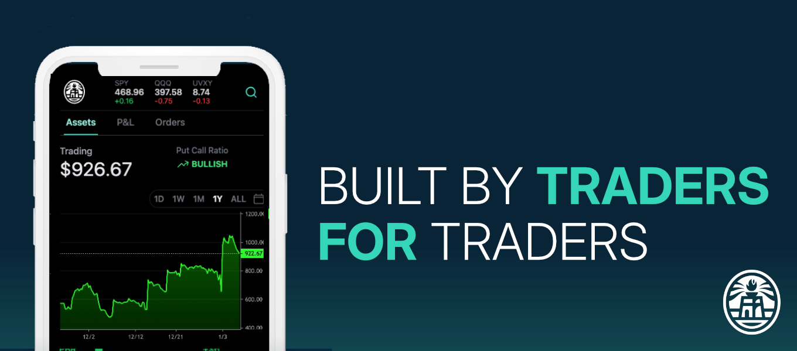

# Welcome

BlazeTrade is an all-in-one trading platform for retail traders who want to turn passion into profits — from trade generation, to portfolio tracking and automated position management.

<figure><figcaption>
By Traders, For Traders
</figcaption></figure>

## Our Story

In 2017, we left our jobs to pursue trading full-time, driven by a simple dream - could we live on the income generated from trading alone? Like many before us, we believed a passion for markets could translate into reliable profits.

Unfortunately, reality hit us hard. The tools and knowledge we needed to become successful traders simply did not exist. Like most traders, we learned the hard way - through costly mistakes, information overload, and thousands of hours of trial and error. The market is unforgiving to those finding their way alone.

The real problem was that everything we needed was scattered. Essential data lived in legacy brokers, key features in outdated software, and crucial knowledge trapped in closed trading circles. We spent years building BlazeTrade to bring it all together - one platform with everything you need to trade consistently and profitably. The same tools that turned our own trading around are now in your hands.

## The Blaze Way

BlazeTrade is an  _**opinionated**_  trading platform. Our software is meant to guide you to what we believe are the best standards and practices of profitable trading. Just like the only way to learn driving is by driving, the only way to learn trading is by trading. Here are few simple rules to help keep you steady on the road to trading profits:

* **Every trade has a well-defined exit** - this means that every trade has a maximum hold duration, a stop loss, and a profit target
* **Price action rules all** - At the end of the day, the only thing that matters is the price and your positions
* **Manage risk ruthlessly** - emotionless trading is a pre-requisite for profits, leverage trading bots to help you stick to your own rules

## Jump right in

<table data-view="cards"><thead><tr><th></th><th></th><th data-hidden data-card-cover data-type="files"></th><th data-hidden></th><th data-hidden data-card-target data-type="content-ref"></th></tr></thead><tbody><tr><td>🔌 <strong>Connect a brokerage</strong></td><td>Link your account to get market data and trade</td><td></td><td></td><td><a href="getting-started/connect-a-brokerage.md">connect-a-brokerage.md</a></td></tr><tr><td>🎯 <strong>Create your first trade</strong></td><td>Build and execute a trade </td><td></td><td></td><td><a href="getting-started/quickstart.md">quickstart.md</a></td></tr><tr><td>🤖  <strong>Automate strategies</strong></td><td>Set up no-code trading bots</td><td></td><td></td><td><a href="getting-started/publish-your-docs-1.md">publish-your-docs-1.md</a></td></tr></tbody></table>

### Learn with Trading School

<table data-view="cards"><thead><tr><th></th><th></th><th></th><th data-hidden data-card-target data-type="content-ref"></th></tr></thead><tbody><tr><td><strong>Options Basics</strong></td><td>Get started with simple and effective strategies</td><td></td><td><a href="trading-school/option-basics.md">option-basics.md</a></td></tr><tr><td><strong>Market Primer</strong></td><td>Ruthlessly practical approach to managing risk</td><td></td><td><a href="trading-school/images-and-media.md">images-and-media.md</a></td></tr><tr><td><strong>Risk Management</strong></td><td>Take profits or cut losses based on market activity</td><td></td><td><a href="trading-school/interactive-blocks.md">interactive-blocks.md</a></td></tr></tbody></table>
