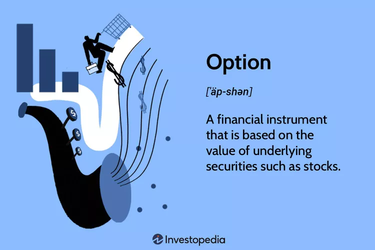

# Option Basics

<figure><figcaption></figcaption></figure>

> _"\[_options] are financial weapons of mass destruction_"  - Warren Buffet_

Any person who has been curious about markets for long enough has no doubt come across options in some form or another. Options are either told as a cautionary tale or sold as a vehicle for financial freedom.&#x20;

Options are versatile tools for expressing an opinion on market movements. Most retail traders start with buying and selling stock since it's easier to understand and safer to mange. As you develop trading experience, the pull of options and responsible leverage is impossible to avoid.

Trading options after trading stock is like going from 2D to 3D. There is a whole new dimension added and your opportunities for profit (and loss) multiply. With great power comes great responsibility.

