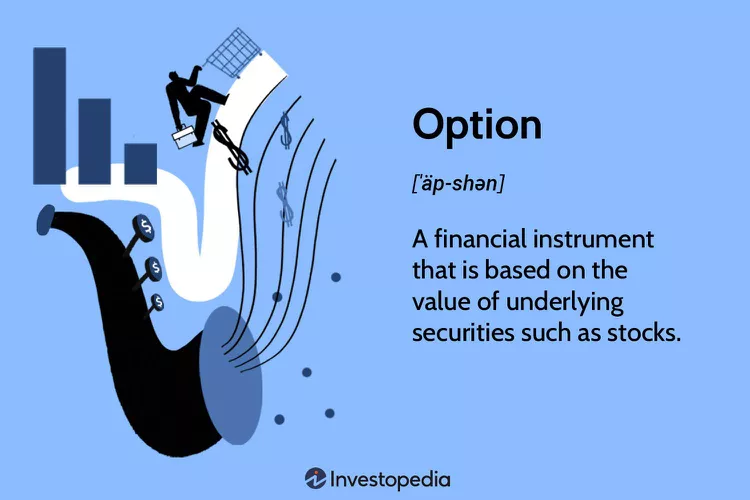

# Option Basics

<figure><figcaption></figcaption></figure>

> _"\[_options] are financial weapons of mass destruction_"  - Warren Buffet_

Any person who has been curious about markets for long enough has no doubt come across options in some form or another. Options are either told as a cautionary tale or sold as a vehicle for financial freedom.&#x20;

Options are versatile tools for expressing an opinion on market movements. Most retail traders start with buying and selling stock since it's easier to understand and safer to mange. As you develop trading experience, the pull of options and leverage is impossible to avoid.

Trading options after trading stock is like going from 2D to 3D. With time, a whole new dimension is added to trading and your opportunities for both profit and loss multiply. With great power comes great responsibility.

Contrary to popular belief, you do not have to be a math genius in order to trade options safely. You just need to observe how options behave and have the right lens to see them transparently.

#### Greeks&#x20;

Greek glyphs are deceptively simple. Option greeks best describe the different kinds of risk involved in a given option contract. However, one greek tends to overpower the others. As my trading mentor once told me, the greek (risk) that you have should be the one that you want.&#x20;

###

